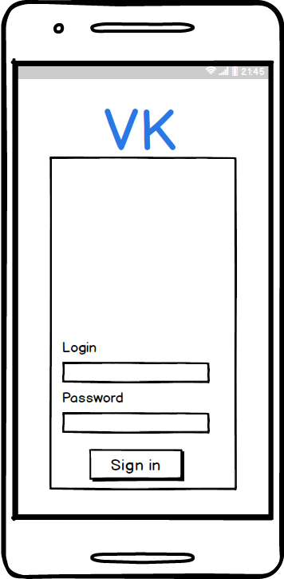
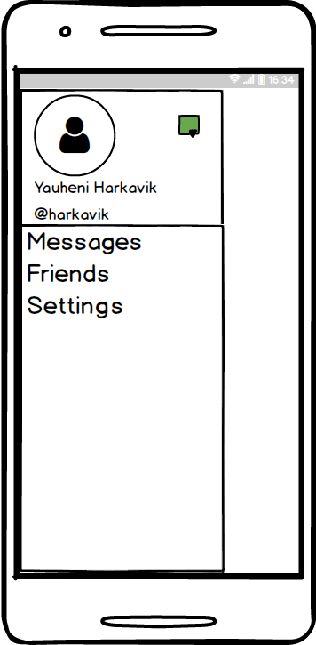
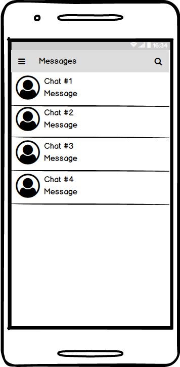
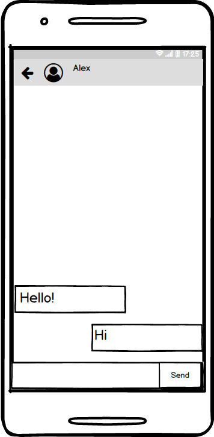
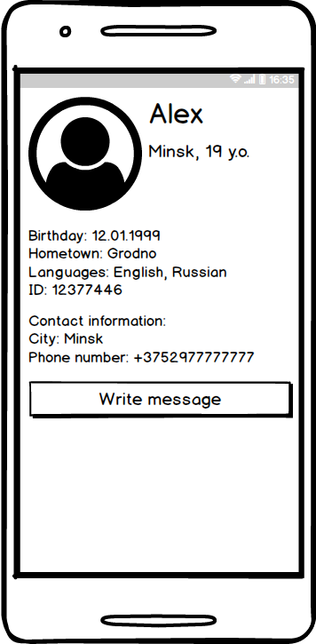
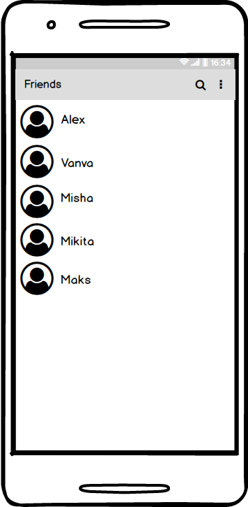

# Требования к проекту
---

# Содержание
1 [Введение](#intro)  
1.1 [Назначение](#appointment)  
1.2 [Бизнес-требования](#business_requirements)  
1.2.1 [Исходные данные](#initial_data)  
1.2.2 [Возможности бизнеса](#business_opportunities)  
1.2.3 [Границы проекта](#project_boundary)  
1.3 [Аналоги](#analogues)  
2 [Требования пользователя](#user_requirements)  
2.1 [Программные интерфейсы](#software_interfaces)  
2.2 [Интерфейс пользователя](#user_interface)  
2.3 [Характеристики пользователей](#user_specifications)  
2.3.1 [Аудитория приложения](#application_audience)   
2.4 [Предположения и зависимости](#assumptions_and_dependencies)  
3 [Системные требования](#system_requirements)  
3.1 [Функциональные требования](#functional_requirements) 	
3.1.1 [Основные функции](#main_functions)   
3.1.1.1 [Вход пользователя в приложение](#user_logon_to_the_application)  
3.1.1.2 [Переход между разделами. Меню приложения](#application_menu)  
3.1.1.3 [Просмотр диалогов пользователя](#show_user_dialogs)  
3.1.1.4 [Просмотр сообщений конкретного диалога](#show_user_dialog_messages)  
3.1.1.5 [Взаимодействие со списком друзей](#user_friend_list)  
3.1.1.6 [Просмотр профиля пользователя ВКонтакте](#show_user_profile_info)  
3.2 [Нефункциональные требования](#non-functional_requirements)  
3.2.1 [Атрибуты качества](#quality_attributes)  
3.2.1.1 [Требования к удобству использования](#requirements_for_ease_of_use)  
3.2.1.2 [Требования к безопасности](#security_requirements)  
3.2.2 [Ограничения](#restrictions)  

<a name="intro"/>

# 1 Введение

<a name="appointment"/>

## 1.1 Назначение
В этом документе описаны функциональные и нефункциональные требования к мобильному приложению «InTouch» для операционной системы Android.

<a name="business_requirements"/>

## 1.2 Бизнес-требования

<a name="initial_data"/>

### 1.2.1 Исходные данные
Часть пользователей ВКонтакте используют неофициальные мобильные клиенты на Android. Использование сторонних клиентов связано в первую очередь с ограниченным фукнционалом, каким обладает официальный клиент, внешним видом, а также ограничениями, которые он возлагает на пользователя, например, прослушивание музыки в фоновом режиме возможно только 30 минут. Совокупность этих факторов и побуждает переходить на сторонние мобильные клиенты.

<a name="business_opportunities"/>

### 1.2.2 Возможности бизнеса
Многие люди, которые используют ВКонтакте, желают иметь приложение, которое предоставляет доступ к своему аккаунту, своим перепискам, а также позволяет получить информацию об друзьях. Подобное приложение позволит им получить быстрый доступ к перепискам, к информации о своём профиле, а также получить актуальную информацию о своих друзьях.

<a name="project_boundary"/>

### 1.2.3 Границы проекта
Приложение «InTouch» позволяет зарегистрированным пользователям во ВКонтате ввести переписку со своими друзьями, а также просматривать их профили.

<a name="analogues"/>

## 1.3 Аналоги
 Функции |VK| Kate Mobile | VK Mp3 Mode
--- | :-: | :-: | :-:
Сообщения |+|+|+
Друзья | +|+|+
Новости |+|+|+
Музыка | +|+|+
"Невидимка" / "нечиталка" | -|+|+
Настройка внешнего вида приложения | -|+|+
Встроенный браузер | -|-|+
Мультиаккаунты |- |-|+

<a name="user_requirements"/>

# 2 Требования пользователя

<a name="software_interfaces"/>

## 2.1 Программные интерфейсы
Приложение использует API ВКонтакте, в частности, специально разработанный SDK под Android для взаимодействия с этим API.

<a name="user_interface"/>

## 2.2 Интерфейс пользователя  
Экран авторизации.  
  
Экран выбора раздела.  
  
Экран сообщений.  
  
Экран диалога.	
	
Экран профиля.	 
  
Экран друзей.  
  

<a name="user_specifications"/>

## 2.3 Характеристики пользователей

<a name="user_classes"/>

### 2.3.1 Аудитория приложения

Люди, для которых старый интерфейс приложения, с боковым меню, был более удобен, привычен и красив.
<a name="assumptions_and_dependencies"/>

## 2.4 Предположения и зависимости
1. Приложение не работает при отсутствии подключения к Интернету.

<a name="system_requirements"/>

# 3 Системные требования

<a name="functional_requirements"/>

## 3.1 Функциональные требования

<a name="main_functions"/>

### 3.1.1 Основные функции

<a name="user_logon_to_the_application"/>

#### 3.1.1.1 Вход пользователя в приложение
**Описание.** Пользователь должен использовать существующий аккаунт ВКонтакте для входа в приложение.

| Функция | Требования | 
|:---|:---|
| Вход в приложение, используя существующий аккаунт ВКонтакте | При успешной аутентификации приложение должно предоставить доступ к основным функциям приложения, иначе, при ошибки аутентификации, приложение должно сообщить об этом пользователю   |

<a name="application_menu"/>

#### 3.1.1.2 Переход между разделами. Меню приложения
**Описание.** Пользователь должен иметь удобное меню, а также быстрый доступ к нему.

| Функция | Требования | 
|:---|:---|
| Отображение меню приложения | Меню должно быть в форме списка, а также доступ к нему должен осуществляться свайпом по экрану   |
| Выбор раздела в меню | При выборе раздела, приложение должно открыть соответствующий раздел и предоставить актуальную информацию, соответствующую разделу   |

<a name="show_user_dialogs"/>

#### 3.1.1.3 Просмотр диалогов пользователя
**Описание.** Пользователь должен иметь возможность просматривать список своих диалогов, а также переход к конкретному из них.

| Функция | Требования | 
|:---|:---|
| Отображение диалогов пользователя | Отображение диалогов должно быть оформлено в виде списка, с краткой информацией об диалоге: название диалога, содержание последнего сообщения и его время, фото пользователя, с которым ведётся диалог.   |
| Выбор конкретного диалога | Открытие окна, в котором отображаются сообщения выбранного диалога    |

<a name="show_user_dialog_messages"/>

#### 3.1.1.4 Просмотр сообщений конкретного диалога
**Описание.** Пользователь должен иметь возможность просматривать сообщения конкретной беседы или с конкретным пользователем.

| Функция | Требования | 
|:---|:---|
| Отображение сообщений диалога | Информация должна отображаться в удобной форме: сообщения должны быть отделены друг от друга, должно отображаться время их отправки, сообщения пользователя, который использует текущий мобильный клиент, должны быть различимы, т.е. расположены с противоположной стороны сообщений, которые получил пользователь, и выделены другим цветом|

<a name="user_friend_list"/>

#### 3.1.1.5 Взаимодействие со списком друзей
**Описание.** Пользователь должен иметь возможность просмотра списка друзей, а также взаимодействовать с ним.

| Функция | Требования | 
|:---|:---|
| Отображение списка друзей | Информация должна быть представлена в виде списка, а также содержать: фото друга, имя и фамилию    |
| Выбор конкретного друга | Открытие профиля друга  |
| Долгое нажатие на конкретного друга | Открытие выпадающего меню, где определены две функции: удаление друга из списка друзей и занесение друга в чёрный список    |

<a name="show_user_profile_info"/>

#### 3.1.1.6 Просмотр профиля пользователя ВКонтакте
**Описание.** Пользователь должен иметь возможность просмотра профилей своих друзей и своего профиля, а также возможность начать диалог с пользователем.

| Функция | Требования | 
|:---|:---|
| Отображение профиля пользователя ВКонтакте | Отображаемая информация должна содержать: фотографию, имя и фамилию, дату рождения, номер телефона, город, ID. Конечно, если эту информацию предоставил пользователь. |
| Выбор кнопки начала диалога | Открытие диалога с пользователем. |

<a name="non-functional_requirements"/>

## 3.2 Нефункциональные требования
* Наличие смартфона
* Интернет соединение

<a name="quality_attributes"/>

### 3.2.1 Атрибуты качества

<a name="requirements_for_ease_of_use"/>

#### 3.2.1.1 Требования к удобству использования
1. Доступ к основным функциям приложения не более чем за три касания;
2. Привычно-ассоциируемый интерфейс[1];
3. Использование Material Design;
4. Использование Long Polling запросов, для получения обновлённых данных, например, новых сообщений.

1↑ —  Приложения 1 ГОСТ 21480-76
<a name="security_requirements"/>

#### 3.2.1.2 Требования к безопасности
Приложение должно хранить Access Token в Preferences, и доступ к нему должно иметь только это приложение.

<a name="restrictions"/>

### 3.2.2 Ограничения
* Приложение доступно для смартфонов с версией Android 5.0 и выше
* Приложение реализована на языке Java
